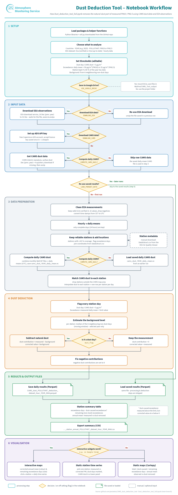

# CAMS Natural Dust Deduction Tool

This repository estimates how much of the particulate matter measured at European air-quality stations comes from natural Saharan and other desert dust, and subtracts that contribution from the measurements.

The main workflow is the notebook `Dust_deduction_tool_full.ipynb` (the CAMS Natural Dust Service Tool). It supports the natural-source assessment in Article 16 of the Ambient Air Quality Directive (Directive (EU) 2024/2881): identifying where limit-value exceedances are attributable to natural sources, and removing that natural dust from reported concentrations. The method follows the European Commission (DG ENV) guidance on assessing natural dust contributions ([sec 2011-0208](https://data.consilium.europa.eu/doc/document/ST%206771%202011%20INIT/EN/pdf)). Days affected by dust are identified with the CAMS European air-quality interim reanalysis dust product, and the natural contribution is estimated from the station’s own measurements on neighbouring non-dust days.

Created by Jessie Zhang, TNO.

## Notebook workflow

The notebook runs in six stages. The chart below is the hourly workflow, drawn from the current notebook. With `EEA_temporal_flag = 'day'` the UTC daily-grid step is replaced by a per-station local-day CAMS mean (section 4.5).

### 1. Setup and parameters

Section 1 installs `cartopy`, downloads `util.py` from this repository, and imports the helper functions.

Section 2 is where you set the run:

| Setting | Role |
|---|---|
| `Countries` | One or more EEA country codes (for example `["ES"]`, or the full list of reporting countries in the notebook) |
| `YEAR` | Calendar year to analyse |
| `POLLUTANT` | `PM10` or `PM2.5` |
| `dataset` | `E1a` (verified data, reported annually, available from 2013) or `E2a` (up-to-date unverified data, available from 2023) |
| `EEA_temporal_flag` | `hour` or `day`. `hour` is the original path: EEA hourly values are treated as fixed UTC+1 and CAMS is averaged on UTC days. `day` uses EEA’s own daily values, which are in station local time, and sets `USE_DAILY_CAMS` |
| `USE_DAILY_CAMS` | `False` on the hourly path. Set `True` together with `EEA_temporal_flag = 'day'` (the notebook does this automatically). CAMS dust is then averaged over each station’s local day by `cams_data_to_eea_daily.py` |
| `USE_GOOGLE_DRIVE` | If `True` (typical in Colab), files are stored under `/content/drive/MyDrive/CAMS_Tool_output`. If `False`, they stay in the project folder |

Downloads and the heavy processing only need to run once. Later runs reuse the saved files:

| Flag | First run | Later runs | What it does |
|---|---|---|---|
| `DOWNLOAD_EEA` | `True` | `False` | Downloads EEA observations and stores them as a zip |
| `DOWNLOAD_CAMS` | `True` | `False` | Downloads CAMS interim-reanalysis dust |
| `COMPUTE_CAMS_DAILY` | `True` | `False` | Rebuilds daily CAMS dust. Hourly runs write a UTC daily grid. Daily runs rebuild the per-station local-day table; monthly station caches are still reused |
| `USE_DAILY_CAMS` | `True` with `EEA_temporal_flag = 'day'` | `False` for hourly data | Averages CAMS over each station’s local day instead of a single UTC day |
| `LOAD_PARQUET_DATA` | `False` | `True` | Loads the saved daily-results Parquet file and skips recomputation |

Thresholds in the next cell:

* `CAMS_dust_threshold` (default **5 µg/m³**): a day is a dust day when CAMS dust at the station is above this value.
* `POLLUTANT_daily_threshold`: daily limit used for an exceedance. The notebook sets **50 µg/m³ for PM10** and **25 µg/m³ for PM2.5**.
* `Station_Temporal_coverage` (default **65%**): minimum share of days in the selected year required to keep a station.
* `Basline_MA_days` (default **6**): number of neighbouring non-dust days, before the day and again after it, used for the background concentration.

### 2. Input data

Two datasets are downloaded, plus station metadata that you supply yourself.

**EEA observations.** When `DOWNLOAD_EEA` is `True`, the notebook requests Parquet data from the EEA air-quality download API for the selected countries, pollutant, dataset, and time resolution. The request runs from 14 December of the previous year through 31 December of the selected year, so the background window can be computed for the first days of the year. The zip is named `{dataset}_{POLLUTANT}_{EEA_temporal_flag}_{YEAR}.zip` and extracted under `EEA_{POLLUTANT}/{YEAR}/{dataset}/{EEA_temporal_flag}`. Large requests (many countries, or hourly data) can take several minutes. If `DOWNLOAD_EEA` is `False`, an existing zip is extracted instead.

**CAMS dust.** Downloading requires a free Copernicus Atmosphere Data Store account, an API key written to `~/.cdsapirc`, and acceptance of the licence for `cams-europe-air-quality-reanalyses`. The notebook asks for the key on the first download. It retrieves the ensemble interim-reanalysis surface dust field for December of the previous year and for each quarter of the selected year (five zip files), then extracts the NetCDF files into `IRA_dust/`.

**Station metadata.** EEA observations identify a station only by sampling-point id. Latitude, longitude, altitude, and time zone come from a CSV downloaded manually from the [EEA Air Quality Viewer](https://discomap.eea.europa.eu/App/AQViewer/index.html?fqn=Airquality_Dissem.b2g.measurements). Name the file `DataExtract.csv` and place it in the output folder (`CAMS_Tool_output` on Google Drive, or the project folder when `USE_GOOGLE_DRIVE` is `False`). A 2024 extract is included in this repository at `Data/DataExtract.csv`; copy or point the notebook at that file if you want to reuse it. The notebook builds the join key as the first two characters of `Air Quality Station EoI Code`, a slash, and `Sampling Point Id`.

### 3. Data preparation

For the hourly path (`EEA_temporal_flag == 'hour'`), and only when results are not being loaded from Parquet:

1. Keep measurements with validity 1, verification 1 or 2, hourly aggregation, and a non-negative value. EEA hourly timestamps are treated as CET (fixed UTC+1) and converted to UTC.
2. Average each station-day, and keep only days that have all 24 hours.
3. Keep stations whose coverage in `YEAR` is at least `Station_Temporal_coverage`. Rows outside that year are kept for those stations so the background window still has the days before 1 January.
4. Merge station coordinates from `DataExtract.csv`.
5. If `COMPUTE_CAMS_DAILY` is `True`, combine the hourly CAMS NetCDF files and average them to UTC daily means, saved as `IRA_dust/cams_dust_{YEAR}_daily_mean.nc`. Otherwise the saved daily file is loaded. This step can exceed Colab memory; the notebook tells you to run it once on a machine with more memory and copy the NetCDF back.
6. Drop stations outside the CAMS domain, then linearly interpolate daily CAMS dust to each station (`add_cams_daily_dust_by_station` in `util.py`).

For the daily path (`EEA_temporal_flag = 'day'`, which turns `USE_DAILY_CAMS` on):

1. Load the same EEA Parquet extract. Keep validity 1, verification below 3, aggregation `day`, and non-negative values. `Start` is left as the station’s local calendar date. It is not passed through `eea_to_utc`.
2. Apply the same coverage filter and merge `DataExtract.csv`, including `Timezone`.
3. Skip the full-domain UTC daily grid. `add_cams_local_daily_dust` in `cams_data_to_eea_daily.py` reads hourly CAMS one UTC day at a time, interpolates only the station locations, and averages each station over its own local day (see [Time zones](#time-zones) below).
4. The table that comes back has the same columns the hourly path uses (`day`, `daily_mean`, `cams_dust`, coordinates). Dust flags, the background median, the corrected concentration, the station summary, and the plots then run unchanged.

### Time zones

EEA hourly stamps are naive clock times that the notebook treats as fixed UTC+1 (`Etc/GMT-1`, no daylight-saving time) and converts to UTC with `eea_to_utc`. The daily mean is then a UTC day. That conversion is the wrong one for EEA daily values: those stamps are already the local time of the station, and a blanket UTC+1 shift would move a `UTC+02` or `UTC` station onto another date.

`Timezone` in `DataExtract.csv` is a fixed offset such as `UTC`, `UTC+01`, or `UTC-04`. For a station with offset *h* hours, the CAMS mean for local day D is the mean of the UTC hours in `[D 00:00 − h, D+1 00:00 − h)`. The join to the observation is that local calendar date. A day with fewer than 18 equivalent hours of CAMS data (75% of a 24-hour day; the same fraction is used if the file is not hourly) is left missing rather than filled from the nearest day. Daylight-saving transitions are not applied, which matches the hourly path’s fixed offset.

### Memory and Drive cache

The daily path never loads a full hourly CAMS grid. Each NetCDF file is opened lazily, cut to the station bounding box and the dust variable, and read one UTC day at a time as float32. Only the interpolated station series is kept. After each day the day-sized array is released.

Intermediate files follow the notebook’s Drive layout (`/content/drive/MyDrive/CAMS_Tool_output` when `USE_GOOGLE_DRIVE` is `True`, otherwise the project folder):

| File | Role |
|---|---|
| `IRA_dust/cams_dust_station_hourly_<stations>_<source>.parquet` | Hourly dust at the stations for one CAMS file. Reused on the next run, including when `COMPUTE_CAMS_DAILY` is `True` |
| `IRA_dust/cams_dust_local_daily_stations_<stations>_<year>_h18.parquet` | Local-day means. Reused when `COMPUTE_CAMS_DAILY` is `False` |

`<stations>` is a short hash of the station coordinates and time-zone offsets, so a different country list does not reuse the wrong cache. December of the previous year is included, because a positive offset reaches back into 31 December and the EEA request itself starts on 14 December.

### 4. Dust deduction

Each station-day receives two flags:

* **Dust day** (`dust_flag`): CAMS dust at the station is above `CAMS_dust_threshold`.
* **Exceedance** (`Exceedance`): the measured daily mean is above `POLLUTANT_daily_threshold`.

Days that are both a dust day and an exceedance are the candidates for subtracting natural dust. For those days the background is the median of neighbouring non-dust days: up to `Basline_MA_days` non-dust days before the day and the same number after it (`compute_station_baseline`).

On dust days the natural dust contribution is the measured concentration minus that background. The corrected concentration is the background. On all other days the measured concentration is kept. If the background is higher than the measurement, the contribution is negative; those values are set to zero. That can happen because the background is a median of surrounding days, and strong winds during a dust event can also lower local PM at some stations.

An alternative formula that scales CAMS dust by the ratio of observed PM to CAMS PM is sketched in the notebook and left commented out. It is not used.

### 5. Outputs

When `LOAD_PARQUET_DATA` is `False`, the daily table for all stations is written as a Parquet file. With Google Drive the name is:

`CAMS_dust_{POLLUTANT}_deduction_{dataset}_{EEA_temporal_flag}_{YEAR}_MA{Basline_MA_days}.parquet`

Example: `CAMS_dust_PM10_deduction_E2a_hour_2025_MA6.parquet`. A later run with `LOAD_PARQUET_DATA = True` reads that same path and skips sections 3–6. With `USE_GOOGLE_DRIVE = False` the save cell writes `CAMS_dust_deduction_{dataset}_{EEA_temporal_flag}_{YEAR}.parquet` in the project folder (no pollutant name and no `MA` suffix), while the load cell looks for the longer name above.

The daily rows are then summarised per station for the selected year:

| Column | Meaning |
|---|---|
| `Exceedance_days` | Days the measured concentration exceeds the limit |
| `Dust_exceedance_days` | Exceedances that no longer exceed the limit after natural dust is subtracted |
| `NonDust_exceedance` | Exceedances that remain after the subtraction |
| `Average_pollutant` | Measured annual mean |
| `Average_pollutant_dust_removed` | Annual mean after subtracting natural dust |

The station summary is written as CSV in the output folder:

* one country: `{country code}_station_annual_{POLLUTANT}_{dataset}_{EEA_temporal_flag}_{YEAR}_MA{Basline_MA_days}.csv` (for example `ES_station_annual_PM10_E2a_hour_2025_MA6.csv`)
* two or more countries: `muti_countries_station_annual_...csv` (the prefix is spelled that way in the notebook)

### 6. Visualisation

Interactive figures are aimed at Google Colab. If the widgets do not run (for example in VS Code or on an HPC node), use the static plots.

* **Interactive annual map** (Plotly): colour is the annual mean after dust removal; marker size is the number of exceedance days that are not attributed to dust.
* **Interactive station time series** (`map_timeseries_clickable_plot` in `util.py`, ipyleaflet): click a station to plot measured and corrected concentrations, with CAMS dust and the two thresholds.
* **Static time series** (`plot_station_timeseries`): same figure for a station id you type in.
* **Static maps** (`plot_exceedance_maps_discrete`, Cartopy): maps of any station-summary column. An *Edit here* block sets `columns_to_plot`, titles, and the colour scale. The map is limited to the countries selected in `Countries`.

## Other Python files

The notebook does not import these scripts, except `util.py`. Paths inside the standalone scripts still point at a TNO project directory unless you edit `project_dir`.

### `util.py`

Shared helpers. The notebook downloads this file from the `main` branch at the start of a run and imports it. The functions the notebook calls are:

| Function | What it does |
|---|---|
| `until_check` | Returns a short string so you can see that the import worked |
| `filter_daily_by_coverage` | Keeps every row for stations whose coverage in a reference year is at least `min_pct` (so days just outside that year remain available for the background window) |
| `add_cams_daily_dust_by_station` | Interpolates a CAMS daily field to each station and attaches `cams_dust` |
| `compute_station_baseline` | For dust days that are also exceedances, median of `neighbor_n` non-dust days before and after |
| `plot_station_timeseries` | Measured vs corrected concentration and CAMS dust for one station |
| `map_timeseries_clickable_plot` | ipyleaflet map; clicking a marker draws that station’s time series |
| `plot_exceedance_maps_discrete` | Static Cartopy maps of station-summary columns |
| `plot_interactive_station_map` | Plotly Mapbox scatter of a station table |
| `eea_hourly_to_utc` | Treats naive EEA timestamps as fixed UTC+1 and converts them to UTC |
| `calculate_data_coverage` | Coverage of each station between two dates (used by the daily-data branch) |
| `compute_median_for_station` | Same background idea as `compute_station_baseline`, with a fixed window of 15 non-dust days on each side |

`filter_daily_by_coverage` and `add_cams_daily_dust_by_station` are each defined twice in the file. The later definition is the one that is used. That coverage function uses the `calendar` module, which `util.py` does not import itself; the notebook assigns `util.calendar = calendar` before calling it. The notebook also pastes its own copy of `plot_exceedance_maps_discrete` into the static-map section.

### `cams_data_download.py`

Standalone CAMS download, separate from the notebook’s download cells.

* **Inputs:** Copernicus ADS credentials in `~/.cdsapirc`. `YEAR` (default 2024) and `VAR` (default `dust`) are set at the top.
* **What it does:** Requests `cams-europe-air-quality-reanalyses` (ensemble, surface level, interim reanalysis) for December of the previous year and for each quarter of `YEAR`, downloads five zip files, and extracts them.
* **Outputs:** `./wp-dust/IRA_dust/CAMS_IRA_*.zip` and the extracted NetCDF files in that folder.
* **Relation to the notebook:** Same ADS dataset and the same five-file split. The notebook writes to `IRA_dust/` (or the Google Drive copy of that folder) instead of `wp-dust/IRA_dust/`.

### `cams_data_to_eea_daily.py`

Daily-observation counterpart of `Dust_discount_hourly.py`. The notebook calls it when `EEA_temporal_flag` is `day`. Importing the module does not download or compute; `python cams_data_to_eea_daily.py` runs `main()`.

* **Inputs:** The same settings as the notebook, at the top of the file: `Countries`, `YEAR`, `POLLUTANT` (`PM10` or `PM2.5`), `dataset` (`E1a` or `E2a`), `EEA_temporal_flag = 'day'`, `DOWNLOAD_EEA`, `DOWNLOAD_CAMS`, `COMPUTE_CAMS_DAILY`, `USE_GOOGLE_DRIVE`, dust threshold, coverage (default 65%), and `Basline_MA_days` (default 6). EEA data come from the same download API as the notebook (dataset id 1 for `E2a`, 2 for `E1a`, 14 December of the previous year through 31 December, `aggregationType` `day`). An existing zip is extracted when `DOWNLOAD_EEA` is `False`. CAMS is the same five-file interim-reanalysis request. Station coordinates and `Timezone` come from `DataExtract.csv` in the output folder, or from `Data/DataExtract.csv` if that is the copy you have.
* **What it does:** Filters daily EEA values the way the notebook filters hourly values (validity, verification, non-negative), without converting local dates to UTC. Keeps stations that meet the coverage rule. Builds CAMS daily means on each station’s local day, in memory-safe chunks, and reuses Drive or local Parquet caches. Then applies the same dust flag (`cams_dust` above the threshold), exceedance flag, neighbour-median background, and clipped dust contribution as the notebook. The background is computed only on days that are both dusty and an exceedance, matching `util.compute_station_baseline` (the hourly script still has the exceedance term commented out).
* **Output:** `CAMS_dust_{POLLUTANT}_deduction_{dataset}_day_{YEAR}_MA{Basline_MA_days}.parquet` in the Google Drive output folder or the project folder. Columns match the notebook (`day`, `daily_mean`, `cams_dust`, `dust_flag`, `Exceedance`, `pollutant_median`, `Dust_contribution`, `corrected_pollutant`, coordinates), so `LOAD_PARQUET_DATA = True` reads this file the same way it reads an hourly result. The filename includes the time resolution, so it does not overwrite an hourly run.
* **Relation to the notebook:** Section 4 of the notebook calls `load_and_filter_eea_daily` and `add_cams_local_daily_dust`, then continues with the existing deduction, summary, and plots. Running the script by itself performs that whole chain and writes the Parquet the notebook would load.

### `Dust_discount_hourly.py`

Standalone hourly PM10 deduction, with settings fixed in the script rather than in notebook widgets.

* **Inputs:** EEA hourly Parquet under `{project_dir}/EEA_PM10/E1a/hour`, metadata `{project_dir}/EEA_PM10/DataExtract.csv`, and either raw CAMS NetCDF in `IRA_dust/` or an existing `IRA_dust/cams_dust_daily_mean.nc`. Optional flags `DOWNLOAD_EEA`, `DOWNLOAD_CAMS`, and `COMPUTE_CAMS_DAILY` default to `False`. The country list, year (2024), dust threshold (5 µg/m³), and PM10 limit (50 µg/m³) are hard-coded. `project_dir` defaults to a TNO path.
* **What it does:** Same outline as the notebook’s hourly path: optional EEA and CAMS downloads, CET-to-UTC conversion, validity and verification filters, 24-hour daily means, a coverage filter (here 75% in 2024), metadata join, interpolation of daily CAMS dust, a dust flag, and a background median. The background uses 15 non-dust days before and after each dust day, and dust is flagged with `>= 5 µg/m³`. Negative contributions are clipped to zero. Corrected PM10 on dust days is the measurement minus that contribution.
* **Output:** `{project_dir}CAMS_dust_deduction_{dataset}_{EEA_temporal_flag}_{YEAR}_v2.parquet`.
* **Relation to the notebook:** An earlier, non-interactive version of the hourly calculation. The notebook does not call it and does not look for the `_v2` filename. You can still open the Parquet in the notebook if you point the load cell at it.

### `storage_flowchart.py`

Draws two Matplotlib figures of an earlier description of storage and processing. Running it writes, in the current directory:

* `storage_flowchart.png` — download, filter, dust flag, baseline, and outputs
* `storage_hierarchy.png` — folder layout and a short list of helper functions

It does not read EEA or CAMS data and is not used by the notebook. The numbers on those figures (for example 75% coverage and a 30-day or 15-day window) are the ones that were drawn into the script; they are not the notebook defaults (65% coverage and `Basline_MA_days = 6`). The workflow chart in `docs/` is a separate image of the current notebook.

## How to run

### Google Colab

1. Open `Dust_deduction_tool_full.ipynb` in Colab (the first notebook cell links to the copy on GitHub).
2. Run Section 1. It installs `cartopy` and replaces the local `util.py` with the copy on the `main` branch. The daily path also needs `cams_data_to_eea_daily.py` in the working directory (clone the repository, or upload the file). If that file is missing, the daily cell downloads whatever is on `main`.
3. In Section 2, set countries, year, pollutant, dataset, and the run flags. Leave `USE_GOOGLE_DRIVE = True` unless you have another place to store the files. For EEA daily data set `EEA_temporal_flag = 'day'` (this turns on `USE_DAILY_CAMS`). Leave it as `hour` to keep the UTC daily-mean path.
4. Put `DataExtract.csv` in `MyDrive/CAMS_Tool_output` before the metadata step.
5. For a first CAMS download, create an ADS account, accept the dataset licence, and paste the API key when the notebook asks.
6. Run the notebook from top to bottom. Set `DOWNLOAD_EEA`, `DOWNLOAD_CAMS`, and `COMPUTE_CAMS_DAILY` back to `False`, and `LOAD_PARQUET_DATA` to `True`, when you only want to reload results and redraw figures.

Interactive maps are written for Colab. If a widget fails, use the static time series and static maps in Section 8.

### Local

1. Clone the repository and install the packages listed below.
2. In Section 2 set `USE_GOOGLE_DRIVE = False`. Outputs then go to the project directory (`project_dir = '.'`).
3. Copy `Data/DataExtract.csv` to `./DataExtract.csv`, or download a newer extract and save it there. The notebook does not read `Data/DataExtract.csv` by itself.
4. Run the cells in order. Skip or adapt the Colab-only lines (`google.colab`, Drive mount). Section 1 still tries to download `util.py` from GitHub; if you are editing that file locally, skip the download and import the local module instead.
5. The clickable ipyleaflet map may not work outside Colab or Jupyter. The static plots in Section 8 do not need it.
6. `cams_data_download.py`, `cams_data_to_eea_daily.py`, and `Dust_discount_hourly.py` are run as scripts (`python cams_data_download.py`, and likewise for the others) after you set `project_dir` and the year. They expect a `~/.cdsapirc` file when they download CAMS data.

## Requirements

There is no pinned environment file. The notebook and scripts import:

* Notebook and `util.py`: `numpy`, `pandas`, `matplotlib`, `cartopy`, `xarray`, `netCDF4`, `scipy` (used by xarray interpolation), `plotly`, `pyarrow`, `requests`, `ipywidgets`, `ipyleaflet`
* CAMS download (notebook and `cams_data_download.py`): `cdsapi` (>= 0.7.7)
* `cams_data_to_eea_daily.py`: also `psutil`
* Colab only: `google.colab` (Drive mount)

`storage_flowchart.py` needs only `numpy` and `matplotlib`.

## Outputs

| Product | Where | Name |
|---|---|---|
| EEA zip | Google Drive `EEA_{POLLUTANT}/{temporal}/` or the local EEA folder | `{dataset}_{POLLUTANT}_{temporal}_{YEAR}.zip` |
| CAMS zips and NetCDF | `IRA_dust/` (Drive or project folder) | `CAMS_IRA_*.zip`, `cams.eaq.ira.ENSa.dust*.nc` |
| Daily CAMS field (hourly path, UTC) | `IRA_dust/` | `cams_dust_{YEAR}_daily_mean.nc` |
| Station-hourly CAMS cache (daily path) | `IRA_dust/` on Drive or in the project folder | `cams_dust_station_hourly_<stations>_<source>.parquet` |
| Local-day CAMS cache (daily path) | `IRA_dust/` on Drive or in the project folder | `cams_dust_local_daily_stations_<stations>_<year>_h18.parquet` |
| Daily deduction table | Google Drive output folder | `CAMS_dust_{POLLUTANT}_deduction_{dataset}_{temporal}_{YEAR}_MA{n}.parquet` |
| Daily deduction table (local save) | Project folder | `CAMS_dust_deduction_{dataset}_{temporal}_{YEAR}.parquet` |
| Station summary | Same output folder | `{country}_station_annual_....csv` or `muti_countries_station_annual_....csv` |

Figures are shown in the notebook. The static-map function can also write a PNG if you pass `savefile`.

## Known limitations / To do

Daily CAMS dust is now part of the deduction when `EEA_temporal_flag` is `day`. A few limits remain:

* **Daylight-saving time is not modelled.** Both paths use the fixed offset in the data: UTC+1 for every hourly stamp, and the `Timezone` label for each daily station. If a country builds its official daily value in civil time, the hour of a spring or autumn transition can sit in the neighbouring local day.
* **The hourly path’s UTC grid can still exceed Colab memory.** `COMPUTE_CAMS_DAILY` on `EEA_temporal_flag = 'hour'` still averages the full CAMS domain. The daily path avoids that by sampling stations one UTC day at a time. It still needs the hourly NetCDF files on disk for the first run, and a Copernicus ADS key to download them.
* **Stations outside the CAMS European domain are dropped** on both paths (for example some overseas territories whose metadata offset is `UTC-04` or `UTC+04`).
* **A local day is kept only when at least 75% of its CAMS hours are present** (18 hours for hourly files). The first and last days of the archive can be missing for stations whose offset reaches outside the downloaded hours.
* The workflow chart in `docs/` shows the hourly path. The daily branch is the extra step in section 4.5 of the notebook.
